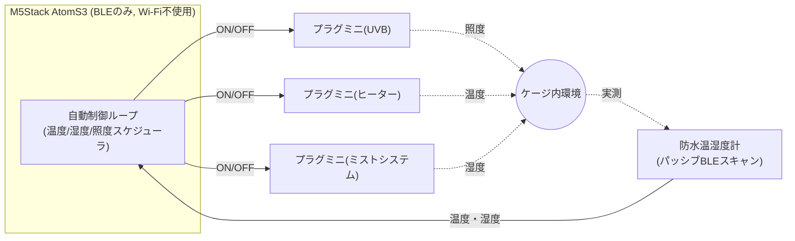

# ニシアフリカトカゲモドキ スマートケージ 自動化ストーリー

## 1. 背景・目的

ニシアフリカトカゲモドキ（*Hemitheconyx caudicinus*）は夜行性〜薄明薄暮性のヤモリで、以下のような環境が健康維持に重要になる。

- **温度**: ホットスポット（保温球・パネルヒーター側）で 29〜32℃ 程度、それ以外は室温＋やや高め。高すぎると脱水・拒食、低すぎると消化不良や免疫低下を招く。
- **湿度**: 55〜70%RH 程度を好み、特に脱皮前後は高湿度（ウェットシェルター内で 80%以上）が必要。乾燥しすぎると脱皮不全（指先の皮残りなど）を起こしやすい。
- **明暗周期（照度）**: 明確な昼夜サイクルが体内時計・食欲・活動リズムに影響する。本種は強い光を苦手とするため、UVB は微量〜任意だが、点灯・消灯のリズム自体は重要。

これまでの動作確認で、AtomS3 から BLE（Wi-Fi 不使用）経由で以下 4 台の SwitchBot 機器を個別に制御できることを確認した。

| 役割 | 機器 | 用途 |
|---|---|---|
| 照度 | プラグミニ①（UVBライト用） | UVBライトの電源オンオフ |
| 温度 | プラグミニ②（パネルヒーター用） | パネルヒーターの電源オンオフ |
| 湿度 | プラグミニ③（ミストシステム用） | ミストシステムの電源オンオフ（電源ONで自動的に噴射が始まる機器） |
| 温湿度計測 | 防水温湿度計 | ケージ内の温度・湿度をパッシブスキャンで取得 |

> ミストシステムは当初 SwitchBot ボットで物理ボタンを押下する方式を想定していたが、
> 電源ON/OFFのみで自動噴射・停止するミストシステム自体の仕様に合わせ、プラグミニで
> 電源を直接制御する方式に変更した（ボットは本システムから外れた）。

次の段階として、この 4 台を **人手を介さず連携させ**、温度・湿度・照度を自動調整するシステムに仕上げる。**AtomS3 本体のボタン操作は行わない**（これまでの検証用の手動トリガーは廃止し、完全自動運転に切り替える）。

## 2. システム全体像

温湿度計の値を起点に、ヒーターとミストを**フィードバック制御**（測って→判断して→操作する）し、UVB ライトは日照リズムを模した**タイマー制御**で回す。3 系統は独立したループとして動き、互いの完了を待たずに並行して動作する。

## 3. 一日の流れ（ストーリー）

### 朝: 起動直後

AtomS3 の電源を入れると、Wi-Fi には一切接続せず BLE スタックだけを起動する。起動直後に一度だけ、温湿度計をスキャンして現在の温湿度を取得し、UVBライト・ヒーター・ミストシステムそれぞれのプラグミニに現在の通電状態を問い合わせる（もしミスト用プラグミニが起動時点で ON のままだった場合は、念のためすぐに OFF にする）。この「今の状態」を起点にして、以降のタイマーと判定基準を組み立てる（時計を持たないため、現実の時刻とは同期しない、電源投入からの相対サイクルであることに注意）。

### 日中: 明るい12時間

起動時にUVBライトが消えていれば点灯し、以後 12 時間その状態を保つ。ケージ内は明るく保たれ、トカゲモドキの活動リズムの手がかりになる。

この間も温湿度計は 5 分おきにスキャンされ続ける。ホットスポットの温度が 32℃ を超えたら、ヒーターに「電源オフ」コマンドを送る。過熱の心配がなくなり 28℃ まで下がったら、再び「電源オン」コマンドを送る。この 4℃ の遊び（ヒステリシス）により、しきい値付近でオンオフを繰り返してリレーを消耗させることを防ぐ。

湿度も同様に見張っていて、55%RH を下回ったらミスト用プラグミニの電源を入れる。このミストシステムは電源投入後 5 秒間のウォームアップを挟んでから自動的に噴射が始まる仕様のため、制御はシンプルに

1. 電源を入れ、
2. 5秒間のウォームアップ＋10秒間の噴射、合計 15秒間待ち、
3. 電源を切る（噴射停止）。

の3ステップだけで済む。この一連の動作は完全に自動で行われる。このミストシステムは電源ONで最大10秒噴射すると自動的に停止する仕様のため、OFFコマンドがまれに失敗して電源が入りっぱなしになっても、噴射し続けて水浸しになるような心配はない（次のトリガーで新たに噴射を始めるために電源を切っておく、という位置づけ）。噴射後は湿度が上がるまで時間がかかるため、次にミストを打てるまで **最短 2 時間のクールダウン** を置き、加湿しすぎ（カビ・過湿による皮膚トラブル）を避ける。

### 夜: 暗い12時間

12 時間が経過すると UVB ライトのタイマーが働き、電源をオフにする。ケージ内は暗くなり、夜行性のトカゲモドキが活動を始める時間帯に入る。温度・湿度の監視とヒーター／ミストの制御は昼夜を問わず同じロジックで継続する（夜間だけ基準を変える、といった作り込みは今回は行わない）。

### 異常時: センサーが応答しない

温湿度計からの応答が一定時間（例: 30 分）得られない場合、温度が実際にどうなっているか分からない状態でヒーターを稼働させ続けるのは危険なため、**安全側に倒してヒーターをオフ**にする。UVB ライトは温湿度に依存しないタイマー制御なので、センサー不調の影響を受けずにサイクルを続ける。ミストも同様に、有効な湿度値が取れていない間は新規噴射を開始しない（既に開始済みの噴射シーケンスは最後まで完了させる）。

BLE 接続自体も物理的な要因（電波干渉、機器の電池切れなど）で失敗しうるため、各コマンドは複数回・アドレスタイプ（Public/Random）を変えながら自動リトライする。数回失敗しても致命的エラーにはせず、次の定期チェックのタイミングで再度試みる。

## 4. 自動制御ロジックの詳細

### 4.1 照度（UVBライト）: タイマー制御

- 起動時にプラグミニの現在状態を読み取り、内部状態として保持する。
- 12 時間（= 43,200,000 ms）経過するたびに ON/OFF を反転する。
- 現実時刻との同期は行わない（Wi-Fi を使わないため NTP 等で時刻合わせができない）。将来的に RTC モジュールや起動時刻の手動設定を追加すれば、日没・日の出に同期させることも可能。
- 反転コマンドが失敗した場合は、通常より短い間隔（例: 1 分後）で再試行し、長時間ずれたままにしない。

### 4.2 温度（パネルヒーター）: ヒステリシス制御

- 5 分おきに温湿度計をスキャンする。
- 現在ヒーターが ON かつ温度が **32.0℃ 以上** → OFF にする。
- 現在ヒーターが OFF かつ温度が **28.0℃ 以下** → ON にする。
- その他の場合（28〜32℃ の間、または既に望む状態）は何もしない。
- コマンドが失敗した場合、次回の定期チェックで自動的に再判定される（ヒステリシスのおかげで「前回の指示」を覚えておく必要がない）。

### 4.3 湿度（ミストシステム用プラグミニ）: ヒステリシス＋クールダウン制御

- 同じ温湿度計のスキャンで湿度も同時に取得する。
- 湿度が **55%RH 未満**、かつ前回の噴射から **2 時間以上** 経過していれば、ミストシーケンス（電源ON→15秒待機→電源OFF）を自動実行する。
- 噴射直後は空気中の水分が安定するまで実測値が乱れやすいため、クールダウン中は判定自体を行わない。
- 噴射シーケンスの実行中（合計 15 秒程度）は他の判定をブロックしてよいものとする（クールダウンが2時間あるため1日最大でも十数回程度の頻度であり、この間 UVB・ヒーターの判定が数十秒遅れても実害はない）。
- ミストシステム自体が最大10秒で噴射を自動停止するため、OFFコマンドが失敗しても噴射し続ける危険はない。次回のトリガーに備えて電源を切っておくだけの位置づけのため、失敗時は次回の定期チェックの冒頭で再度OFFを試みる程度でよい。

## 5. パラメータ一覧（初期値・調整可能）

| パラメータ | 初期値 | 説明 |
|---|---|---|
| UVB サイクル長 | 12 時間 | ON/OFF を反転する間隔 |
| 温湿度チェック間隔 | 5 分 | 温湿度計をスキャンする頻度 |
| ヒーター OFF しきい値 | 32.0℃ | これ以上でヒーターを切る |
| ヒーター ON しきい値 | 28.0℃ | これ以下でヒーターを入れる |
| 湿度 ミスト開始しきい値 | 55%RH | これ未満でミスト実行を検討 |
| ミスト クールダウン | 2 時間 | 前回噴射からの最短間隔（最短噴霧間隔） |
| ミスト ウォームアップ時間 | 5 秒 | 電源ON直後、噴射が始まるまでの待機（この間は噴射されない） |
| ミスト噴射時間 | 10 秒 | ウォームアップ後、電源ONで自動的に噴射している最大時間 |
| ミスト合計待機時間 | 15 秒 | 電源ONから電源OFFまでの合計待機（ウォームアップ+噴射） |
| センサー無応答の許容時間 | 30 分 | これを超えるとヒーターを安全側（OFF）に固定 |
| BLE コマンドリトライ回数 | 3 回 | Public/Random アドレスタイプを交互に試行 |

いずれも本ケージ・機器の設置場所（特に温湿度計をどこに固定するか）によって最適値は変わるため、実運用しながら調整する前提の初期値とする。

## 6. 制約・今後の課題

- **時計を持たない**: Wi-Fi を使わないため、UVB の 12 時間サイクルは「起動してからの相対時間」であり、実際の日の出・日の入りとは無関係。長期運用でズレていく感覚があれば RTC モジュールの追加を検討する。
- **温湿度計は1台のみ**: ケージ内に温度・湿度の勾配（暖かい側／涼しい側）があっても、測定できるのは設置した1点のみ。ヒーター側（ホットスポット付近）に設置するか、ケージ全体の代表点にするかは運用しながら決める。
- **照度センサーがない**: 「照度の自動調整」は照度センサーによるフィードバックではなく、タイマーによる点灯・消灯スケジュールで代替する。
- **単一障害点**: AtomS3 自体がフリーズ・再起動した場合、起動直後は現在の機器状態を読み直すため大きな実害はない想定だが、長時間の給電断・機器不調を検知して通知する手段は今回のスコープには含まない。

## 7. 次のステップ

1. 本ストーリーの内容（しきい値・間隔など）についてレビュー・調整
2. `switchbot_ble.h/.cpp` はそのまま流用し、`main.cpp` を「動作確認スケッチ」から本節の自動制御ロジックに置き換え
3. AtomS3 の画面に現在の温湿度・UVB/ヒーター状態・次回ミストまでの残り時間などを常時表示するダッシュボード表示を実装
4. 実機での長時間（最低 24 時間以上）動作テストとパラメータ微調整
